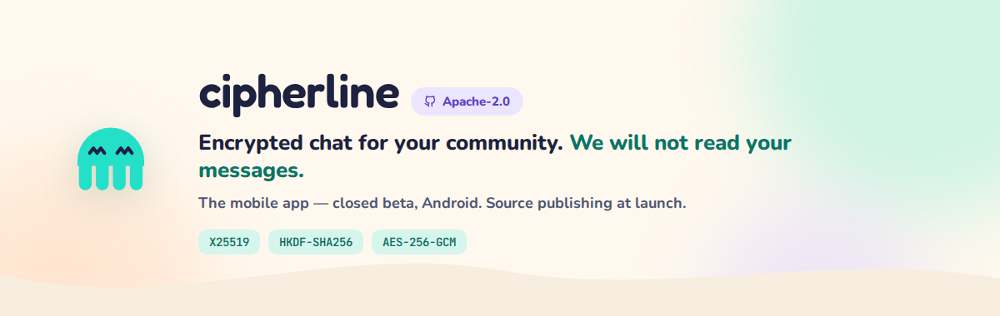

  

 

**The privacy-first alternative to Discord, Slack, and Teams — end-to-end encrypted.**

[Website](https://cipherline.chat) · [Security](https://cipherline.chat/security) · [Report a vulnerability](SECURITY.md)

---

## What Cipherline is

Your own servers, roles, channels, voice and video calls. Your messages, files and
calls are encrypted on your phone before they leave it, so our server relays them
without being able to read them. It still has to see some things to deliver them
(who you're connected with, when, and how big a file is); the full, honest list is
at [cipherline.chat/security](https://cipherline.chat/security).

## Status: closed beta on Android and iPhone, and this repo is public before the source is

The Cipherline **mobile app** is currently in **closed beta on Android and iPhone** —
there's no public release yet. This repo — Apache-2.0 licensed —
is where its source lands. **Publishing the source is planned for launch, not done
yet.** Right now this repo holds only its README, license and policies;
there's no client code to read here today. Watch or star the repo if you'd
like to know the moment that changes.

## What will be here at launch

- The full mobile client source
- Build instructions — clone, install, run, no account required to inspect the code
- The same cryptography the desktop client uses, so you can verify it yourself:
  X25519 key exchange, HKDF-SHA256 derivation, AES-256-GCM for content, Ed25519
  signatures, and one-time prekeys for forward secrecy — the same standard we hold
  the [desktop client](https://github.com/Cipherline-chat/cipherline-desktop) to
- Third-party dependency attributions under the Apache-2.0 license

## Why the client and not the server

Because "trust us, it's encrypted" isn't good enough — a claim like that should be
checkable. The client is what touches your messages, keys and calls, so it's what
we're publishing. The server stays closed: it's a blind relay that never holds the
keys to your content either way, and keeping its code private mainly slows abuse
rather than hiding anything it could read.

## In the meantime

- **[CONTRIBUTING.md](CONTRIBUTING.md)** — how beta testers can report bugs and
  suggest features while the source isn't here yet.
- **[cipherline.chat/opensource](https://cipherline.chat/opensource)** — the
  current status of this plan, in more detail, with a link to this repo and the
  desktop one.
- **[cipherline.chat/security](https://cipherline.chat/security)** — what each
  client encrypts today and what our server can still see.
- **[cipherline-desktop](https://github.com/Cipherline-chat/cipherline-desktop)** —
  the flagship desktop client's repo; its full source is published there.

---

Cipherline — encrypted chat for your people.

